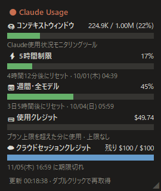
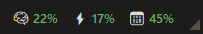

# Claude Monitor

Claude の使用状況をデスクトップに表示する、Windows 用の小さなウィジェットです。

- 🧠 コンテキストウィンドウ（最後にやり取りした会話）
- ⚡ 5時間制限 / 📅 週間の使用率とリセットまでの時間
- 💳 使用クレジット / ☁ クラウドセッションクレジット

Claude デスクトップアプリを開くと表示され、閉じると隠れます。

| 通常表示 | コンパクト表示 |
|---|---|
|  |  |

## 必要なもの
- Windows 10 / 11
- Claude デスクトップアプリ（Pro などの有料プラン）
- Python 3（Microsoft Store の「Python」で OK）

## 使い方
1. 緑の「Code」→「Download ZIP」でダウンロードし、zip を右クリック →「**すべて展開**」
   （zip のままでは正しく動きません）
2. 展開した `claude_monitor.pyw` を消えないフォルダ（例: ドキュメント）に置く
3. Claude Code に一度ログインしておく（最初の 1 回だけ）
   - **PowerShell** の場合: `cd ~` → `claude`
   - **コマンドプロンプト** の場合: `cd %USERPROFILE%` → `claude`
     （行の先頭に `PS` がなければコマンドプロンプトです。`cd ~` は使えません）
   - 「Yes, I trust this folder」を選び、画面が出たら `/exit` で終了
4. `claude_monitor.pyw` をダブルクリック

起動すると 5 秒間「起動しました」と表示され、その後は Claude アプリが開いている間だけ表示されます。
初回起動時にスタートアップへ自動登録され、PC 起動後は裏で待機します。

### 起動しないときは
1. エクスプローラーで `claude_monitor.pyw` のあるフォルダを開く
2. アドレスバーをクリックして `cmd` と入力 → Enter（そのフォルダでコマンドプロンプトが開きます）
3. `python claude_monitor.pyw` を実行し、表示されたエラーを確認

- `'python' は…認識されていません` → Python をインストールしてください
- `No such file or directory` → フォルダの場所かファイル名（`claude_monitor.pyw`）を確認してください

### 操作
- ドラッグ: 移動（位置は次回起動時も記憶）/ 右下の ◢ をドラッグ: 大きさ変更/ ダブルクリック: 再取得 / 右クリック: メニュー（コンパクト表示・最前面・終了）
- コンパクト表示: `🧠15%  ⚡7%  📅24%` の1行だけの小さな表示に切り替わります（アイコンにカーソルを乗せると項目名が出ます）
- 「ログイン期限切れ」と出たら、表示される「🔑 ログインを更新する」ボタンを押してください（裏で Claude Code を 1 回だけ起動して更新します。Haiku に短い入力を 1 回送るため、使用量はごくわずかにかかります）

## 注意
- **非公式ツールです。** Anthropic とは関係ありません。自己責任でお使いください。
- 使用状況は非公開の API から取得しているため、予告なく動かなくなることがあります。
- ログイン情報（`~/.claude/.credentials.json`）は読み取るだけで、書き換えません。送信先は Anthropic の公式サーバー（api.anthropic.com）のみです。
- アンインストール: 右クリック →「終了」後、スタートアップフォルダ（`Win+R` → `shell:startup`）の `claude_monitor.bat` を削除。

## ライセンス
MIT
